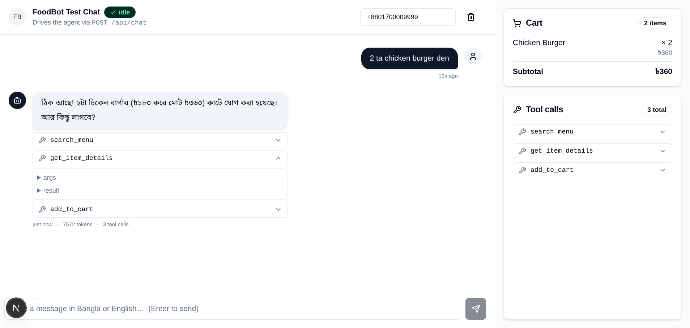

# Bangla WhatsApp Restaurant AI — Phase 1 MVP

Voice-first WhatsApp ordering assistant for a Bangladeshi restaurant. Customers send Bangla (or Banglish) voice / text messages; the system understands the order, validates it against the real menu, asks for clarification when ambiguous, and stores a confirmed order in PostgreSQL.

> **Phase 1 only** — no dashboard, no TTS, no payments, single restaurant.

## Stack

Node 20, TypeScript (strict), Fastify, PostgreSQL 16, Redis 7, BullMQ, Google Gemini 3.6 Flash (audio + chat + function calling), zod, pino, Vitest.

## Setup

### 1. Prerequisites

- Node 20+
- Docker + Docker Compose
- A Google Gemini API key (free tier works: https://aistudio.google.com/apikey)
- A Meta WhatsApp Business account with a verified phone number

### 2. Install dependencies

```bash
npm install
```

### 3. Environment

Copy `.env.example` → `.env` and fill in:

- `GEMINI_API_KEY` (get a free key at https://aistudio.google.com/apikey)
- `WHATSAPP_TOKEN`, `WHATSAPP_PHONE_NUMBER_ID`, `WHATSAPP_BUSINESS_ACCOUNT_ID`, `WHATSAPP_WEBHOOK_VERIFY_TOKEN`, `WHATSAPP_APP_SECRET`
- Anything else that needs overriding

### 4. Start Postgres + Redis + app

```bash
docker compose up --build
```

The `app` service runs migrations and seeds automatically on first run.

### 5. (Local dev, no Docker for the app)

If you want to run the Node process on your host:

```bash
docker compose up postgres redis
cp .env.example .env  # and edit DATABASE_URL/REDIS_URL to localhost
npm install
npm run migrate
npm run seed
npm run dev
```

## Meta WhatsApp setup

1. Create a Meta App → Add **WhatsApp** product.
2. In **WhatsApp → API Setup**, copy:
   - Phone number ID → `WHATSAPP_PHONE_NUMBER_ID`
   - WhatsApp Business Account ID → `WHATSAPP_BUSINESS_ACCOUNT_ID`
   - Generate a permanent system-user access token → `WHATSAPP_TOKEN`
3. In **WhatsApp → Configuration → Webhook**:
   - Callback URL: `https://<your-public-host>/webhook` (use `ngrok http 3000` for local dev)
   - Verify token: must equal `WHATSAPP_WEBHOOK_VERIFY_TOKEN`
   - Subscribe to: `messages`, `message_echoes` (optional)
4. Webhook fields auto-subscribed: `messages` (text + audio).

## Test the webhook

```bash
curl -X POST http://localhost:3000/webhook \
  -H 'Content-Type: application/json' \
  -H 'X-Hub-Signature-256: sha256=...' \
  -d '{
    "object": "whatsapp_business_account",
    "entry": [{
      "id": "123",
      "changes": [{
        "value": {
          "messaging_product": "whatsapp",
          "metadata": { "phone_number_id": "..." },
          "messages": [{
            "from": "8801700000000",
            "id": "wamid.test",
            "timestamp": "1700000000",
            "type": "text",
            "text": { "body": "2 ta chicken burger den" }
          }]
        },
        "field": "messages"
      }]
    }]
  }'
```

The signature header must be `sha256=<HMAC-SHA-256 of body using WHATSAPP_APP_SECRET>`. To skip verification in dev, leave the header off — the signature check is non-blocking in MVP but the request still requires a valid payload.

## Architecture

See `docs/superpowers/specs/2026-08-24-bangla-whatsapp-restaurant-ai-design.md`.

```
src/
  index.ts config.ts logger.ts
  db/   redis/   queue/
  webhook/   whatsapp/   speech/
  ai/  conversation/  menu/  cart/  customer/  order/
  common/   admin/
data/menu.json
db/migrations/
```

## Tests

```bash
npm test           # unit + integration (167 tests across 25 files)
npm run test:watch # watch mode
npm run lint
```

The integration suite covers the full pipeline — webhook signature verification, idempotent inbound, mocked Gemini tool-calling loop, server-side price revalidation on `create_order`, and the unavailable-item rejection path.

## Deploy (production)

```bash
docker compose up --build              # boots Postgres + Redis + app
docker compose --profile seed up       # also seeds menu data on first install
```

The `migrate` service runs idempotently before `app` starts (a migration failure aborts the stack). The `app` container's healthcheck gates load balancers: it calls `GET /healthz`, which returns 503 when any BullMQ worker heartbeat is missing or any dependency is unreachable.

For production:

```bash
export ADMIN_BASIC_AUTH_PASS="$(openssl rand -hex 24)"
export NODE_ENV=production
docker compose up --build -d
```

API documentation lives at `/docs` (Swagger UI) once the app is running.

## Operational notes

- Dead-letter inspection: `GET /admin/queues/dlq` (basic auth).
- Interactive API docs: `GET /docs` (Swagger UI), `GET /docs/json` (raw OpenAPI).
- Money is stored as integer paisa. `formatBDT(123456)` → `"৳1,234"`.
- The agent never invents prices or menu items. Every tool handler re-reads from the database.
- An order is only created when the customer explicitly says yes to the summary and the agent calls `create_order({ confirm: true })`.
- Public endpoints (`POST /webhook`, `POST /api/chat`) are rate-limited per-IP and per-phone via Redis. Override defaults with `RATELIMIT_WEBHOOK_PER_MIN` and `RATELIMIT_CHAT_PER_MIN`.

## Test chat UI (internal)

A small Next.js 16 + shadcn/ui page lives in `web/` and proxies calls to the Fastify backend. It bypasses the WhatsApp webhook — just type Bangla or English and watch the agent respond. Tool calls and the current cart are visible on the right side.



Run both servers together:

```bash
npm run dev          # Fastify on :3000 + Next.js on :3001
# or separately:
npm run dev:api      # Fastify on :3000
npm run dev:web      # Next.js on :3001
```

Open <http://localhost:3001> in a browser. The phone field defaults to a fresh customer; each tab keeps its own chat in localStorage.

The UI calls `POST /api/chat` on the Fastify backend. The backend persists the inbound text + outbound reply to the same `messages` table the webhook uses, so the conversation history survives a webhook roundtrip too.